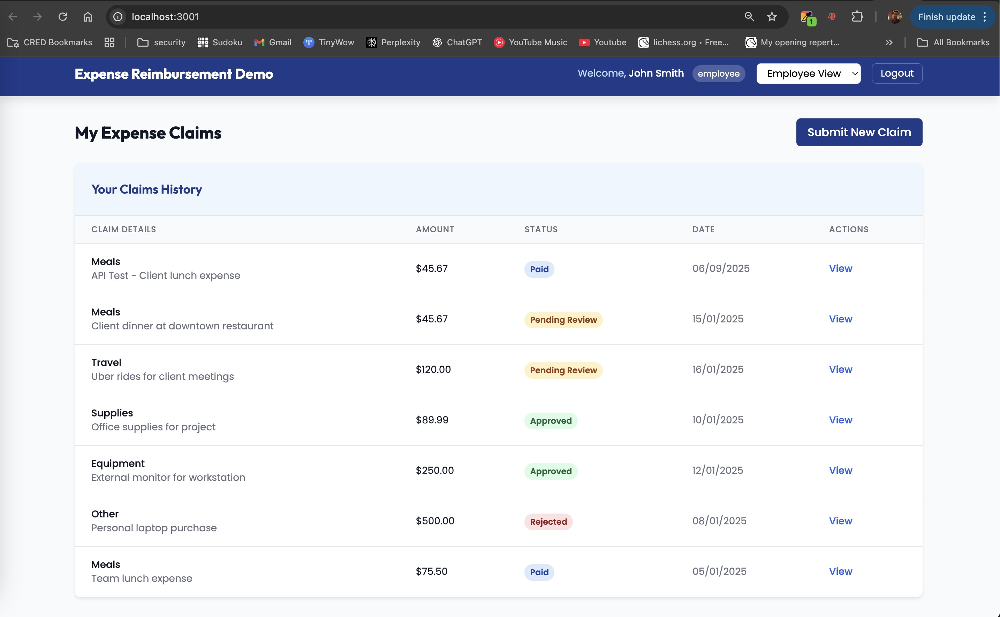
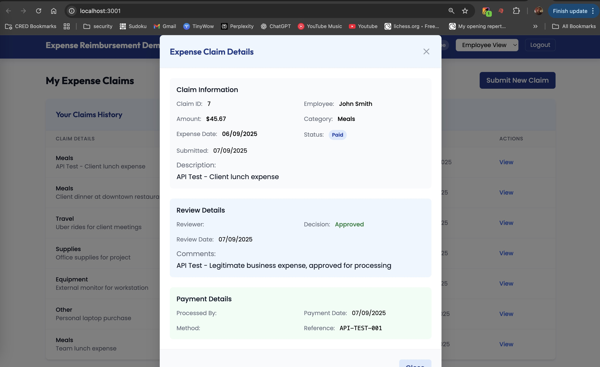
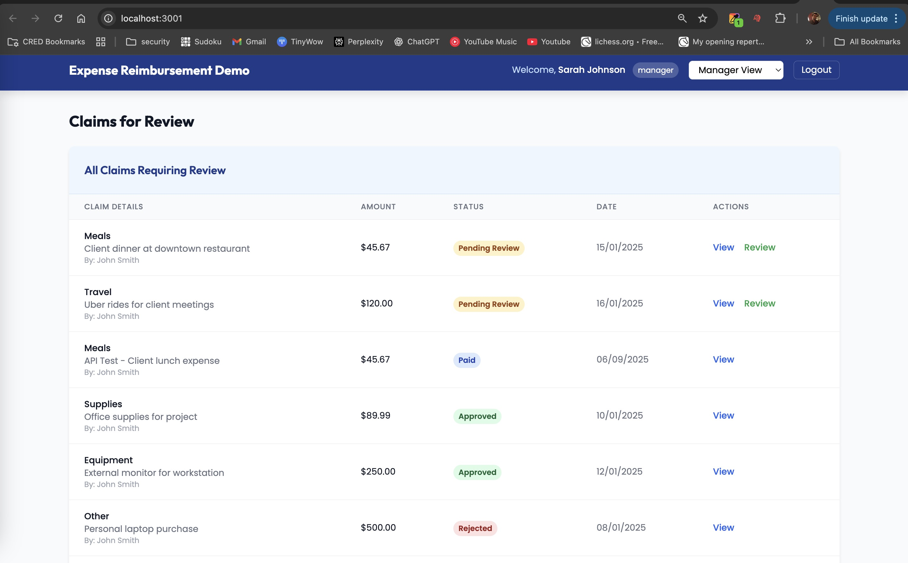
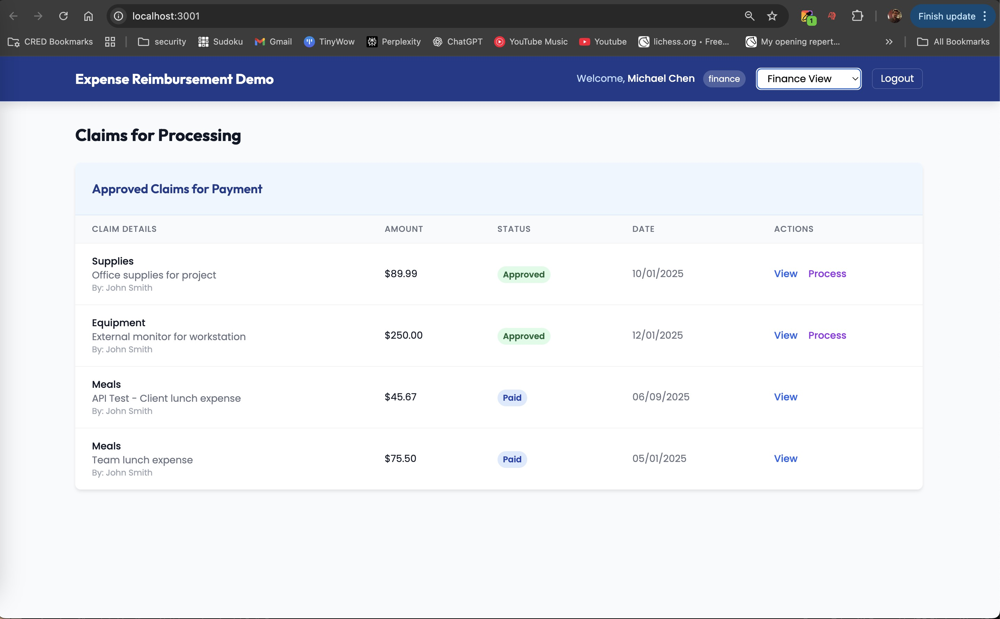
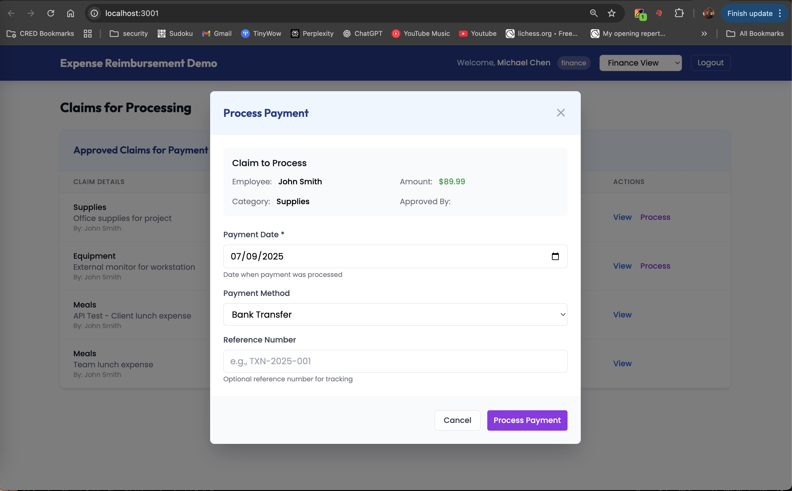
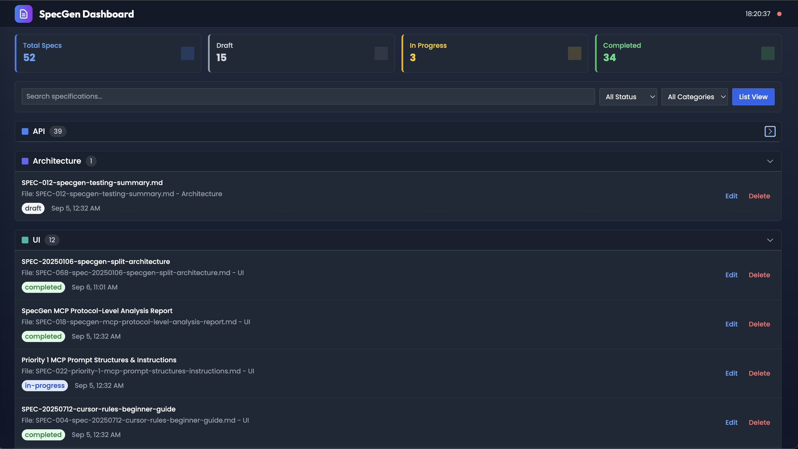
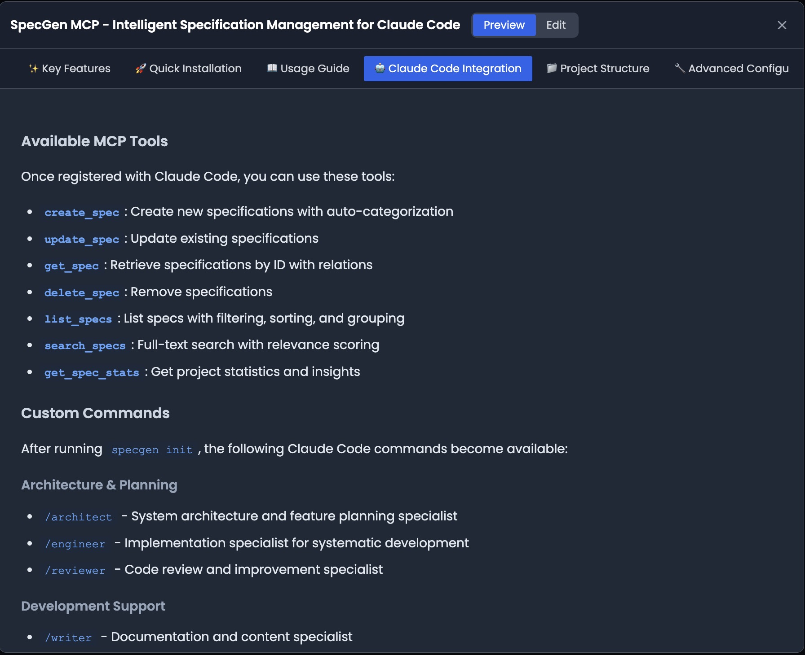
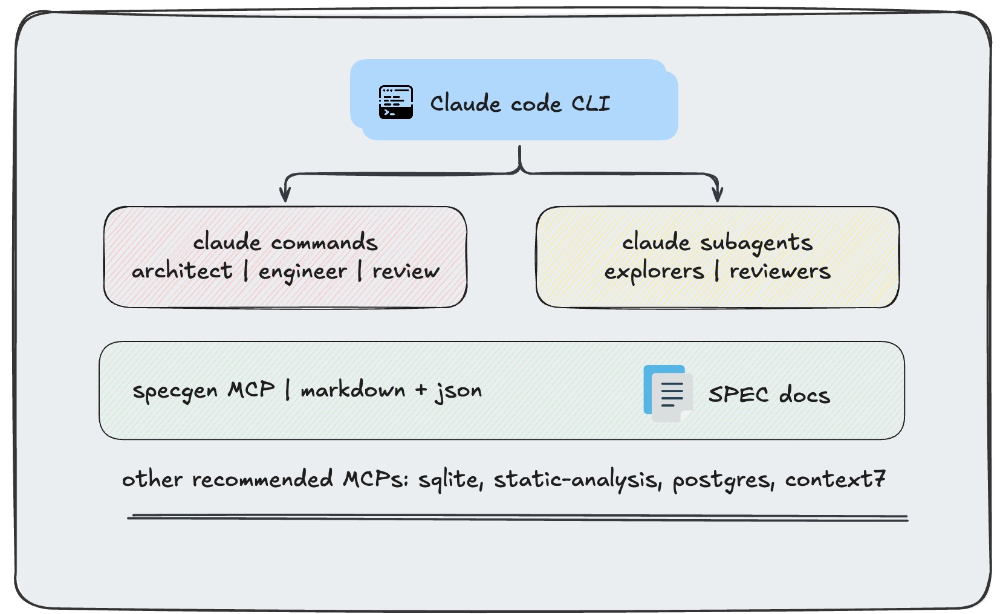

# Agentic workflows - specgen: elegant context engineering solution for Claude Code!

*Using well-stitched Claude Code features for rapid AI-assisted coding with guardrails*

*Stop juggling between 15 browser tabs, scattered notes, and endless context switching*


**Finally, AI workflows that actually work together.** Instead of asking Claude the same questions over and over, create specialized agents that remember context, build on each other's work, and turn complex development tasks into simple conversations.

---

## The problem

You know that feeling when you're deep in a complex feature or when the codebase gets large after adding a few features, and you have to:
- Explain your entire codebase to Claude... again
- Switch between architecture planning and implementation  
- Keep track of decisions made 3 conversations ago
- Coordinate different types of analysis (security, performance, etc.)

**What if your AI agents could talk to each other and build lasting knowledge about your project?**

## Table of contents

- [What makes this different](#what-makes-this-different)
- [🌟 Showcase](#-showcase)
- [📊 Dashboard](#-dashboard)  
- [🚀 Get started in 2 minutes](#-get-started-in-2-minutes)
- [🔧 Solution overview](#-solution-overview)
- [🎯 Use cases](#-use-cases)
- [🏗️ Architecture](#️-architecture)
- [📦 Components](#-components)
- [🔗 Recommended MCPs](#-recommended-mcps)

## What makes this different

🧠 **Agents that remember**: Your project context persists across conversations
🔄 **Workflows that connect**: Architecture → Implementation → Review in one flow  
📝 **Specs that live**: Documentation that updates as you build
🎯 **Observability that helps**: One stop dashboard to understand what each command, agent and feature is being worked on

## 🌟 Showcase

### 🎬 Live demo: Expense reimbursement system

**Location**: [`showcase/expense-reimbursement-demo`](showcase/expense-reimbursement-demo)

**One-shot implementation**: Complete three-stage approval workflow built with 3 prompts


*Employee expense submission interface*


*Manager review and approval process*


*Finance team final processing*


*Real-time status tracking and notifications*


*Complete audit trail and reporting*

**Technical stack**: Express.js, SQLite, Session Management, File Upload, Multi-user Authentication
**Implementation time**: <30 minutes from concept to working application
**Agent coordination**: 5 specialized agents collaborated through shared specifications

### 📋 Implementation traces & logs

**Find demo app, prompts & analysis**: Complete implementation reasoning preserved in:
- app - /Users/pawanraviee/Documents/GitHub/agentic-workflows/showcase/expense-reimbursement-demo
- `docs/SPEC-20250105-expense-reimbursement.md` - Full architectural analysis and decisions
- '/Users/pawanraviee/Documents/GitHub/agentic-workflows/showcase/prompts' - input prompts and Claude code output traces

## 📊 Project statistics

**Real implementation data** (Expense Reimbursement Demo):
- **Input prompt size**: 89 lines of feature specification
- **Input prompt messages**: 3 total (1 architect + 1 engineer + 1 debug)
- **Generated output**: 3,480 lines (2,268 + 1,212) of comprehensive implementation logs
- **Implementation time**: <30 minutes from concept to working application
- **Agent coordination**: 5 specialized agents collaborated through shared specifications
- **Code generation ratio**: 39x output amplification (89 lines → 3,480 lines)
- **Features implemented**: 10 complete features(auth system, claim submission, 3-stage workflow, role-based access, file upload, validation, API endpoints, frontend dashboard, database schema, session management)
- **Codebase size**: 2,767 lines across 11+ source files (JS, HTML, CSS, SQL)

Have a cool project? [Share it with us!](./showcase/)

## 📊 Dashboard


*Visual overview of all specifications with status tracking and filtering*


*Detailed specification view with metadata and content*

The integrated dashboard provides a visual interface for managing your specifications:
- **Real-time sync** with file changes
- **Status tracking** (Todo, In Progress, Completed)
- **Category filtering** and search
- **Direct editing** capabilities
- **Export options** for sharing

## 🚀 Get started in 2 minutes

### The easiest way

Just ask Claude Code:

> **"Install specgen-mcp for me from https://github.com/pwnk77/agentic-workflows"**

That's it. Claude will:
- Install SpecGen MCP
- Configure everything for you
- Set up all the agents and commands
- Get you ready to build better

### See it working

Once installed, try your first workflow:

```bash
# Ask Claude to architect a new feature
/architect "Add user profile editing with image upload"

# Watch as multiple agents coordinate:
# → Research agent finds best practices
# → Backend explorer analyzes your API patterns  
# → Frontend explorer checks your component structure
# → All findings get saved to a living specification

# Then implement it:
/engineer SPEC-20250105-user-profiles

# Finally review it:
/reviewer SPEC-20250105-user-profiles --security --performance
```

### Manual installation

```bash
# Install SpecGen MCP
npm install -g specgen-mcp

# Configure Claude Code (if not auto-configured)
claude mcp add specgen -s user -- npx -y specgen-mcp@latest

# Initialize in your project
specgen init

# Launch dashboard
specgen dashboard
```

See [QUICKSTART.md](./QUICKSTART.md) for detailed setup instructions.


## 🔧 Solution overview

**Specification-driven development methodology**: Every feature begins with AI-generated comprehensive specifications before any code is written. This approach ensures architectural consistency and eliminates the traditional disconnect between planning and implementation.

**Context persistence architecture**: Project knowledge accumulates across conversations through MCP-managed specification files. Unlike traditional AI interactions that lose context, agents build cumulative understanding of your codebase patterns, architectural decisions, and implementation preferences.

**Multi-agent coordination system**: Eight specialized AI agents work collaboratively within shared context documents. Backend-explorer, frontend-explorer, database-explorer, and integration-explorer analyze different architectural layers while quality, performance, and security agents provide continuous review throughout development.

**MCP protocol integration**: Direct Claude Code integration through Model Context Protocol enables real-time specification management. Specifications serve as single source of truth, consolidating all agent insights and architectural analysis into living documents that persist and evolve.

**Workflow architecture orchestration**: Three-stage architect → engineer → reviewer workflow ensures comprehensive feature development. Each stage builds upon previous analysis, maintaining consistency and traceability from initial concept to production-ready code.

## 🎯 Use cases

- **Feature Development**: End-to-end feature planning, implementation, and review
- **Architecture Analysis**: Deep codebase exploration and architectural decision making
- **Code Review**: Multi-perspective code analysis with specialized review agents
- **Documentation**: Automated specification generation and maintenance
- **Research**: Best practice research and technology evaluation
- **Project Planning**: Specification-driven development planning

## 🏗️ Architecture


*how claude code, commands, agents, and SpecGen MCP work together*

## 📦 Components

### Core workflows (`/core-workflows`)

**Claude Code configuration system**
- **Agents directory**: Specialized AI agents for different development phases
  - **Explorers**: `backend-explorer`, `frontend-explorer`, `database-explorer`, `integration-explorer`, `researcher`
  - **Reviewers**: `quality`, `performance`, `security`
- **Commands directory**: High-level workflow orchestrators
  - `architect` - Feature analysis and specification generation
  - `engineer` - Implementation and development
  - `reviewer` - Code quality and architecture review
- **Hooks directory**: System notifications and integrations
- **Settings**: Local configuration for Claude Code

### SpecGen MCP (`/specgen-mcp`)

**Project specification management with MCP integration**

- **File-based storage**: Markdown specifications with automatic organization
- **MCP protocol**: Direct integration with Claude Code for real-time spec management
- **Auto-categorization**: Intelligent grouping by feature, priority, and status
- **Dashboard interface**: Web-based visualization and management
- **Search & discovery**: Full-text search across all specifications
- **Agent integration**: Seamless workflow between agents and specifications

**Key features:**
- 📝 Create, update, and manage project specifications
- 🔍 Search and discover existing specs across projects
- 📊 Visual dashboard for specification overview
- 🔗 Direct MCP integration with Claude Code agents
- 📂 Automatic file organization and categorization
- 🚀 Real-time updates during agent workflows

## 🔗 Recommended MCPs

Enhance your workflow with these compatible MCPs:

- **[Static Analysis MCP](https://www.npmjs.com/package/@r-mcp/static-analysis)**: TypeScript code analysis, symbol tracking, and compilation error detection
- **Chrome MCP**: Browser automation and web interaction capabilities
- **Database MCPs**: PostgreSQL, SQLite, and other database integrations
- **Additional MCPs**: Extend functionality based on your project needs

## 🔧 Development

### Repository structure

```
agentic-workflows/
├── README.md                    # This file
├── QUICKSTART.md               # Installation guide
├── core-workflows/
│   └── claude-code/            # Claude Code configuration
│       ├── agents/             # Specialized AI agents
│       ├── commands/           # Workflow commands
│       ├── hooks/              # System hooks
│       └── settings.local.json # Configuration
├── specgen-mcp/                # SpecGen MCP implementation
│   ├── src/                    # TypeScript source
│   ├── dist/                   # Compiled JavaScript
│   ├── public/                 # Dashboard assets
│   └── README.md              # SpecGen documentation
└── static-analysis/            # Static analysis MCP (standalone)
```

### Contributing

1. Fork the repository
2. Create a feature branch
3. Make your changes
4. Test with Claude Code integration
5. Submit a pull request

## 📄 License

MIT License - see [LICENSE](./LICENSE) for details.

---

**Ready to stop explaining your project over and over?** 

Just ask Claude Code: *"Install specgen-mcp for me from https://github.com/pwnk77/agentic-workflows"*

Then try: `/architect "your next feature idea"`

Watch the magic happen. ✨

---

*Built with ♥️ for developers who want AI workflows that actually work together*  
*Powered by [Claude Code](https://claude.ai/code) and [Model Context Protocol](https://modelcontextprotocol.io/)*